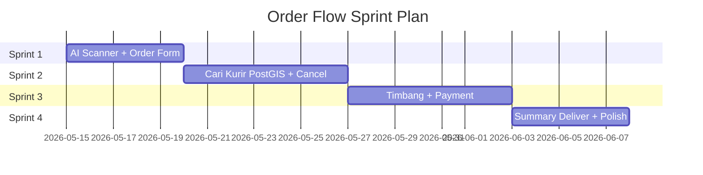

# 🚀 Angkutin — Order Flow Sprint Backlog

> Berdasarkan analisis [order_endpoint_analysis](file:///f:/Disk%20E/project%20coding/angkutin/angkutin-be/order_endpoint_analysis) dan kondisi aktual codebase.

---

## Status Proyek Saat Ini

| Komponen | Status |
|----------|--------|
| Schema Prisma (Order, Courier, Wallet, Payment) | ✅ Lengkap |
| Orders Service (CRUD, status transition, tracking) | ✅ Ada |
| Couriers Service (profile, status, order actions) | ✅ Ada |
| Wallet Service (balance, withdraw, topup) | ✅ Ada |
| Xendit Service (payout/disbursement) | ✅ Ada |
| Triage/Weighing detail submission | ❌ Belum ada |
| Payment for Order (QRIS, Wallet, E-Wallet) | ❌ Belum ada |
| Courier GPS saat toggle online | ⚠️ Perlu update |

---

## Overview Sprint



---

## Sprint 1 — AI Scanner & Order Form (5 hari)

> **Goal:** User bisa scan sampah via AI dan submit order lengkap.

### Task 1.1 — AI Analyze: Hapus `objectDetected`
| Item | Detail |
|------|--------|
| **Story Point** | 1 |
| **File** | [orders.service.ts](file:///f:/Disk%20E/project%20coding/angkutin/angkutin-be/src/orders/orders.service.ts#L298-L313) |
| **Deskripsi** | Hapus field `objectDetected` dari response `analyzeAndSaveAiResult()`. Sesuai catatan analisis, field ini tidak diperlukan. |

**Acceptance Criteria:**
- [ ] `POST /api/orders/ai-analyze` tidak return `objectDetected`
- [ ] Response hanya: `volumeEstimation`, `recommendedVehicle`, `confidenceScore`, `id`
- [ ] Swagger docs terupdate

---

### Task 1.2 — Validasi Create Order DTO
| Item | Detail |
|------|--------|
| **Story Point** | 2 |
| **File** | [create-order.dto.ts](file:///f:/Disk%20E/project%20coding/angkutin/angkutin-be/src/orders/dto/create-order.dto.ts) |
| **Deskripsi** | Review dan pastikan DTO sudah lengkap: `addressId`, `wasteItems[]`, `scheduleType`, `scheduledAt?`, `note?`, `aiResultId?`. Tambahkan validasi class-validator jika belum ada. |

**Acceptance Criteria:**
- [ ] Semua field tervalidasi dengan decorator (`@IsUUID`, `@IsEnum`, `@IsArray`, dll)
- [ ] Error message dalam Bahasa Indonesia
- [ ] `wasteItems` minimal 1 item

---

### Task 1.3 — Review Create Order Flow
| Item | Detail |
|------|--------|
| **Story Point** | 2 |
| **File** | [orders.service.ts](file:///f:/Disk%20E/project%20coding/angkutin/angkutin-be/src/orders/orders.service.ts#L11-L110) |
| **Deskripsi** | Review method `create()` — pastikan link AI result, kalkulasi harga, dan auto-assign berjalan benar. |

**Acceptance Criteria:**
- [ ] `POST /api/orders` berhasil membuat order
- [ ] `wasteItems` terhitung `subtotal` dan `totalCredit` benar
- [ ] `aiResult` ter-link ke order jika `aiResultId` diberikan
- [ ] Status awal = `CREATED`, lalu `autoAssignCourier` dipanggil

---

### Task 1.4 — Test Manual: Full Create Order
| Item | Detail |
|------|--------|
| **Story Point** | 1 |
| **Deskripsi** | Test end-to-end via Swagger/Postman: buat alamat → AI scan → create order → cek hasilnya. |

**Acceptance Criteria:**
- [ ] Order tercreate dengan status `CREATED` atau `MATCHED`
- [ ] Data address, wasteItems, aiResult tampil di `GET /api/orders/:id`

> **Total Sprint 1: 6 SP**

---

## Sprint 2 — Cari Kurir (PostGIS) & Pickup/Cancel (7 hari)

> **Goal:** Kurir bisa go-online dengan GPS, sistem auto-assign via PostGIS radius search, kurir accept order, dan cancel sesuai aturan per role.

### Task 2.1 — Update Toggle Status + GPS Location
| Item | Detail |
|------|--------|
| **Story Point** | 3 |
| **Files** | [couriers.service.ts](file:///f:/Disk%20E/project%20coding/angkutin/angkutin-be/src/couriers/couriers.service.ts#L214-L222), [couriers.controller.ts](file:///f:/Disk%20E/project%20coding/angkutin/angkutin-be/src/couriers/couriers.controller.ts#L35-L50) |
| **Deskripsi** | Update `PATCH /api/couriers/status` agar menerima `lat` dan `lng` di body. Saat kurir online, simpan posisi awal ke `currentLat`/`currentLng`. |

**Detail Implementasi:**
```typescript
// Body request baru:
{ isOnline: boolean, latitude?: number, longitude?: number }

// Service update:
async updateStatus(userId, isOnline, lat?, lng?) {
  // ... update isOnline + currentLat + currentLng
}
```

**Acceptance Criteria:**
- [ ] `PATCH /api/couriers/status` menerima `latitude` dan `longitude` opsional
- [ ] Saat `isOnline: true`, posisi kurir terupdate di DB
- [ ] Saat `isOnline: false`, posisi tetap (atau di-null-kan)
- [ ] Backward compatible (lat/lng opsional)

---

### Task 2.2 — Setup PostGIS Extension
| Item | Detail |
|------|--------|
| **Story Point** | 2 |
| **Deskripsi** | Aktifkan PostGIS di database PostgreSQL dan siapkan kolom geography untuk lokasi kurir. |

**Detail Implementasi:**
```sql
-- Migration SQL
CREATE EXTENSION IF NOT EXISTS postgis;

-- Tambah kolom geography di tabel couriers (atau buat via raw query di Prisma)
ALTER TABLE couriers ADD COLUMN IF NOT EXISTS location geography(Point, 4326);

-- Index untuk spatial query
CREATE INDEX IF NOT EXISTS idx_couriers_location ON couriers USING GIST(location);

-- Trigger: auto-update location saat currentLat/currentLng berubah
CREATE OR REPLACE FUNCTION update_courier_location()
RETURNS TRIGGER AS $$
BEGIN
  IF NEW.current_lat IS NOT NULL AND NEW.current_lng IS NOT NULL THEN
    NEW.location = ST_SetSRID(ST_MakePoint(NEW.current_lng, NEW.current_lat), 4326);
  ELSE
    NEW.location = NULL;
  END IF;
  RETURN NEW;
END;
$$ LANGUAGE plpgsql;
```

**Acceptance Criteria:**
- [ ] PostGIS extension aktif di database
- [ ] Kolom `location` geography ada di tabel `couriers`
- [ ] Spatial index tercreate
- [ ] Trigger auto-sync `location` dari `currentLat`/`currentLng`

---

### Task 2.3 — Auto-Assign Kurir via PostGIS Radius Search
| Item | Detail |
|------|--------|
| **Story Point** | 8 |
| **File** | [orders.service.ts](file:///f:/Disk%20E/project%20coding/angkutin/angkutin-be/src/orders/orders.service.ts#L315-L357) |
| **Deskripsi** | Upgrade `autoAssignCourier()` menggunakan PostGIS `ST_DWithin` dengan pencarian radius bertahap: **3km → 5km → 7km**. Jika setelah 7km dan 20 detik tidak ada kurir, order otomatis di-cancel. |

**Detail Implementasi:**
```typescript
async autoAssignCourier(orderId: string) {
  const order = await this.getOrderWithAddress(orderId);
  const { latitude, longitude } = order.address;
  const vehicleType = order.aiResults[0]?.recommendedVehicle;

  const radiusSteps = [3000, 5000, 7000]; // meter

  for (const radius of radiusSteps) {
    // PostGIS raw query: cari kurir online dalam radius
    const couriers = await this.prisma.$queryRaw`
      SELECT c.id, c.vehicle_type,
             ST_Distance(c.location, ST_SetSRID(ST_MakePoint(${longitude}, ${latitude}), 4326)) as distance
      FROM couriers c
      WHERE c.is_online = true
        AND c.location IS NOT NULL
        AND ST_DWithin(
          c.location,
          ST_SetSRID(ST_MakePoint(${longitude}, ${latitude}), 4326)::geography,
          ${radius}
        )
      ORDER BY
        CASE WHEN c.vehicle_type = ${vehicleType} THEN 0 ELSE 1 END,
        distance ASC
      LIMIT 1
    `;

    if (couriers.length > 0) {
      // Assign courier terdekat
      await this.assignCourier(orderId, couriers[0].id);
      return;
    }
  }

  // Semua radius gagal → tunggu 20 detik, lalu auto-cancel
  setTimeout(async () => {
    const currentOrder = await this.prisma.order.findUnique({ where: { id: orderId } });
    if (currentOrder?.status === 'CREATED') {
      await this.cancelOrder(orderId, 'SYSTEM', 'SYSTEM',
        'Tidak ada kurir tersedia dalam radius 7km');
    }
  }, 20_000);
}
```

> [!NOTE]
> **Strategi Radius Bertahap:**
> 1. **3km** — cari kurir terdekat dulu (kualitas terbaik)
> 2. **5km** — perluas jika 3km kosong
> 3. **7km** — radius maksimal
> 4. **20 detik timeout** — jika setelah 7km masih kosong, order auto-cancel dengan alasan "kurir tidak tersedia"

**Acceptance Criteria:**
- [ ] Pencarian menggunakan PostGIS `ST_DWithin` dengan radius bertahap
- [ ] Kurir dengan kendaraan yang sesuai diprioritaskan
- [ ] Kurir terdekat dalam radius yang sama dipilih pertama
- [ ] Jika 7km kosong, tunggu 20 detik lalu auto-cancel
- [ ] Order yang sudah ter-assign tidak di-cancel oleh timeout
- [ ] `OrderCancellation` tercatat dengan `cancelledBy: SYSTEM`

---

### Task 2.4 — Review Accept Order
| Item | Detail |
|------|--------|
| **Story Point** | 1 |
| **Files** | [couriers.controller.ts](file:///f:/Disk%20E/project%20coding/angkutin/angkutin-be/src/couriers/couriers.controller.ts#L78-L86) |
| **Deskripsi** | Pastikan accept → `ON_GOING` berjalan benar. |

> [!NOTE]
> **Reject/Reassignment tidak diimplementasi di sprint ini.** Fitur reassignment akan ditambahkan di iterasi berikutnya jika diperlukan.

**Acceptance Criteria:**
- [ ] Accept: status `MATCHED` → `ON_GOING`, history tercatat
- [ ] Reject endpoint di-skip/disable untuk sekarang

---

### Task 2.5 — Update Cancel Order Rules (Per Role)
| Item | Detail |
|------|--------|
| **Story Point** | 3 |
| **File** | [orders.service.ts](file:///f:/Disk%20E/project%20coding/angkutin/angkutin-be/src/orders/orders.service.ts#L209-L259) |
| **Deskripsi** | Update logic cancel agar berbeda antara **User** dan **Courier**. |

**Aturan Cancel:**

| Role | Bisa Cancel | Tidak Bisa Cancel |
|------|-------------|-------------------|
| **User** | `CREATED`, `MATCHED`, `ON_GOING` | `ARRIVED` dan seterusnya |
| **Courier** | `MATCHED`, `ON_GOING`, `ARRIVED`, `WEIGHING`, `WAITING_PAYMENT` | `PICKED_UP` dan seterusnya |
| **Admin** | Semua status (kecuali `COMPLETED`, `CANCELLED`) | — |

**Detail Implementasi:**
```typescript
async cancelOrder(orderId, userId, role, reason?) {
  const order = await this.prisma.order.findUnique({ where: { id: orderId } });

  // Cancel rules per role
  const userCancellable = [CREATED, MATCHED, ON_GOING];
  const courierCancellable = [MATCHED, ON_GOING, ARRIVED, WEIGHING, WAITING_PAYMENT];

  let allowed: OrderStatus[];
  if (role === 'ADMIN') {
    allowed = [CREATED, MATCHED, ON_GOING, ARRIVED, WEIGHING, WAITING_PAYMENT, PICKED_UP, DELIVERING];
  } else if (role === 'COURIER') {
    allowed = courierCancellable;
  } else {
    allowed = userCancellable;
  }

  if (!allowed.includes(order.status)) {
    throw new BadRequestException(
      `Tidak bisa membatalkan pesanan dalam status ${order.status}`
    );
  }
  // ... proceed cancel
}
```

**Acceptance Criteria:**
- [ ] User TIDAK bisa cancel saat status `ARRIVED` ke atas
- [ ] Courier TIDAK bisa cancel saat status `PICKED_UP` ke atas
- [ ] Admin bisa cancel di semua status aktif
- [ ] `cancelledBy` field tercatat benar: `USER`, `COURIER`, atau `SYSTEM`
- [ ] Error message jelas jika cancel ditolak
- [ ] `OrderCancellation` record tersimpan

---

### Task 2.6 — Review GPS Tracking Endpoints
| Item | Detail |
|------|--------|
| **Story Point** | 1 |
| **Deskripsi** | Test `POST /couriers/orders/:id/location`, `GET /orders/:id/tracking`, `GET /orders/:id/tracking/history`. |

**Acceptance Criteria:**
- [ ] Lokasi kurir terupdate + tracking log tersimpan
- [ ] User bisa poll lokasi terbaru kurir
- [ ] History menampilkan semua titik tracking

> **Total Sprint 2: 18 SP**

---

## Sprint 3 — Timbang & Payment (7 hari) ⚠️ Sprint Terberat

> **Goal:** Kurir bisa submit data timbangan, sistem hitung net balance, dan user bisa bayar via Wallet/QRIS/E-Wallet.

### Task 3.1 — Endpoint Triage Submission
| Item | Detail |
|------|--------|
| **Story Point** | 5 |
| **Files** | Buat baru: `src/orders/dto/submit-triage.dto.ts`, Update: `orders.service.ts`, `couriers.controller.ts` |
| **Deskripsi** | Buat endpoint baru untuk kurir submit data timbangan setelah `start-weighing`. |

**Detail Implementasi:**
```typescript
// POST /api/couriers/orders/:id/triage
// Body:
{
  wasteItems: [
    { wasteTypeId: "uuid", weight: 3.5 }   // MUTU items
  ],
  residualWeight: 1.2,                       // Berat residu (kg)
  residualPhotoUrl?: string                  // Foto bukti residu
}

// Service logic:
// 1. Hitung totalCredit = Σ(mutu.weight × mutu.unitPrice)
// 2. Hitung totalDebit = residualWeight × pricingResidual.pricePerKg
// 3. netTotal = totalCredit - totalDebit
// 4. Simpan OrderWasteItem[] + OrderResidual
// 5. Update Order: totalCredit, totalDebit, netTotal
// 6. If netTotal > 0 → status PICKED_UP (user dapat uang)
//    If netTotal < 0 → status WAITING_PAYMENT (user harus bayar)
```

**Acceptance Criteria:**
- [ ] Endpoint menerima data waste items + residual
- [ ] `OrderWasteItem` records tercreate/terupdate dengan harga dari `WasteType`
- [ ] `OrderResidual` record tercreate dengan harga dari `PricingResidual`
- [ ] `netTotal` terhitung: positif = user untung, negatif = user bayar
- [ ] Status otomatis berubah sesuai hasil kalkulasi
- [ ] DTO tervalidasi dengan class-validator

---

### Task 3.2 — Upload Foto Residu di Triage
| Item | Detail |
|------|--------|
| **Story Point** | 2 |
| **File** | `couriers.controller.ts`, `upload.service.ts` |
| **Deskripsi** | Tambahkan file upload di endpoint triage untuk foto bukti residu. |

**Acceptance Criteria:**
- [ ] Kurir bisa upload foto saat submit triage
- [ ] Foto tersimpan di Supabase storage bucket
- [ ] `photoUrl` tersimpan di `OrderResidual`

---

### Task 3.3 — Payment Endpoint: Bayar via Wallet
| Item | Detail |
|------|--------|
| **Story Point** | 5 |
| **Files** | Buat baru: `src/orders/dto/pay-order.dto.ts`, Update: `orders.service.ts`, `orders.controller.ts` |
| **Deskripsi** | Buat endpoint untuk user bayar order yang `netTotal < 0` via saldo wallet. |

**Detail Implementasi:**
```typescript
// POST /api/orders/:id/pay
// Body: { method: "WALLET" }

// Service logic:
// 1. Validasi order status = WAITING_PAYMENT
// 2. Hitung amount = Math.abs(netTotal)
// 3. Cek saldo wallet cukup
// 4. Debit wallet via walletService.processOrderPayment()
// 5. Create Payment record (status: PAID)
// 6. Update order: paymentStatus = "PAID", status → PICKED_UP
```

**Acceptance Criteria:**
- [ ] User bisa bayar via saldo wallet
- [ ] Saldo terpotong, `WalletTransaction` tercatat
- [ ] `Payment` record tercreate dengan status `PAID`
- [ ] Order status berubah ke `PICKED_UP`
- [ ] Gagal jika saldo tidak cukup

---

### Task 3.4 — Payment Endpoint: Generate Invoice Xendit (QRIS/E-Wallet/Bank)
| Item | Detail |
|------|--------|
| **Story Point** | 8 |
| **Files** | Update: `xendit.service.ts`, `orders.service.ts`, `orders.controller.ts` |
| **Deskripsi** | Buat Xendit Invoice untuk pembayaran via QRIS, E-Wallet (Dana, ShopeePay, dll), atau Bank Transfer. |

**Detail Implementasi:**
```typescript
// POST /api/orders/:id/pay
// Body: { method: "QRIS" | "DANA" | "SHOPEEPAY" | "BCA_VA" | ... }

// XenditService: createInvoice()
// → Xendit Invoice API (supports QRIS + E-Wallet + VA in one invoice)

// GET /api/orders/:id/payment
// → Return payment status + invoice URL + QR URL
```

**Acceptance Criteria:**
- [ ] Xendit Invoice tercreate dengan amount = `Math.abs(netTotal)`
- [ ] `Payment` record tersimpan: `externalId`, `invoiceUrl`, `expiredAt`
- [ ] `GET /orders/:id/payment` return status + URL
- [ ] Swagger docs lengkap

---

### Task 3.5 — Xendit Payment Webhook
| Item | Detail |
|------|--------|
| **Story Point** | 5 |
| **Files** | Update: `wallet.service.ts` atau buat `payment-webhook.controller.ts` |
| **Deskripsi** | Handle callback dari Xendit saat pembayaran berhasil/gagal/expired. |

**Detail Implementasi:**
```typescript
// POST /api/webhooks/xendit/invoice (public, no auth)
// 1. Verify x-callback-token
// 2. Find Payment by externalId
// 3. If PAID → update Payment.status, Order.paymentStatus, Order.status → PICKED_UP
// 4. If EXPIRED → update Payment.status = EXPIRED
```

**Acceptance Criteria:**
- [ ] Webhook ter-verify dengan callback token
- [ ] Payment status terupdate otomatis
- [ ] Order lanjut ke `PICKED_UP` setelah pembayaran sukses
- [ ] Idempotent (tidak proses ulang jika sudah `PAID`)

---

### Task 3.6 — GET Payment Status Endpoint
| Item | Detail |
|------|--------|
| **Story Point** | 2 |
| **File** | `orders.controller.ts`, `orders.service.ts` |
| **Deskripsi** | Endpoint polling untuk cek status pembayaran order. |

**Acceptance Criteria:**
- [ ] `GET /api/orders/:id/payment` return: `status`, `method`, `amount`, `invoiceUrl`, `qrUrl`, `expiredAt`, `paidAt`
- [ ] Return 404 jika belum ada payment record

> **Total Sprint 3: 27 SP**

---

## Sprint 4 — Summary, Deliver & Polish (5 hari)

> **Goal:** Kurir bisa pickup → deliver → complete, user dapat summary lengkap + wallet credit, dan semua edge case ter-handle.

### Task 4.1 — Wallet Credit untuk User (Net Positif)
| Item | Detail |
|------|--------|
| **Story Point** | 3 |
| **File** | `orders.service.ts`, `wallet.service.ts` |
| **Deskripsi** | Jika `netTotal > 0`, saat order `COMPLETED`, credit saldo user otomatis. |

**Detail Implementasi:**
```typescript
// Di completeOrder flow:
// if (order.netTotal > 0) {
//   await walletService.creditCourierOrder(order.userId, orderId, netTotal, "Kredit sampah mutu");
// }
```

**Acceptance Criteria:**
- [ ] User otomatis dapat saldo jika `netTotal > 0`
- [ ] `WalletTransaction` CREDIT tercatat dengan referenceId = orderId
- [ ] Wallet balance terupdate

---

### Task 4.2 — Courier Earning pada Complete
| Item | Detail |
|------|--------|
| **Story Point** | 3 |
| **Files** | `orders.service.ts`, `wallet.service.ts` |
| **Deskripsi** | Hitung dan credit komisi kurir saat order completed. |

**Acceptance Criteria:**
- [ ] Kurir dapat komisi (bisa flat fee atau % dari order)
- [ ] `WalletTransaction` CREDIT tercatat untuk kurir
- [ ] Kurir bisa lihat earning di wallet history

---

### Task 4.3 — Review Pickup → Deliver → Complete Flow
| Item | Detail |
|------|--------|
| **Story Point** | 2 |
| **Files** | [couriers.controller.ts](file:///f:/Disk%20E/project%20coding/angkutin/angkutin-be/src/couriers/couriers.controller.ts#L122-L181) |
| **Deskripsi** | Pastikan flow `PICKED_UP → DELIVERING → COMPLETED` berjalan mulus dengan foto evidence. |

**Acceptance Criteria:**
- [ ] Pickup: status → `PICKED_UP`
- [ ] Deliver: status → `DELIVERING`
- [ ] Complete: foto wajib, status → `COMPLETED`, foto URL tersimpan di history
- [ ] Semua tercatat di `OrderStatusHistory`

---

### Task 4.4 — Order Detail & Timeline Review
| Item | Detail |
|------|--------|
| **Story Point** | 2 |
| **Files** | `orders.service.ts` |
| **Deskripsi** | Pastikan `GET /orders/:id` dan `GET /orders/:id/timeline` menampilkan data lengkap termasuk triage result dan payment info. |

**Acceptance Criteria:**
- [ ] Order detail include: `wasteItems`, `residuals`, `payments`, `courier`, `address`
- [ ] Timeline menampilkan semua status dengan label Bahasa Indonesia
- [ ] `netTotal`, `totalCredit`, `totalDebit` tampil di response

---

### Task 4.5 — Error Handling & Edge Cases
| Item | Detail |
|------|--------|
| **Story Point** | 3 |
| **Deskripsi** | Handle semua edge case yang mungkin terjadi. |

**Checklist:**
- [ ] Cancel setelah payment → refund ke wallet
- [ ] Double payment prevention (idempotency)
- [ ] Courier offline saat ada active order → warning
- [ ] Order expired jika tidak ada kurir dalam X menit
- [ ] Payment expired handling (Xendit invoice TTL)

---

### Task 4.6 — Integration Test End-to-End
| Item | Detail |
|------|--------|
| **Story Point** | 3 |
| **Deskripsi** | Test full flow dari awal sampai akhir. |

**Test Scenario:**
```
1. User scan sampah → AI analyze
2. User buat order → auto-assign kurir
3. Kurir accept → ON_GOING → ARRIVED
4. Kurir start-weighing → submit triage
5a. Net positif → langsung PICKED_UP
5b. Net negatif → WAITING_PAYMENT → user bayar → PICKED_UP
6. Kurir pickup → deliver → complete (foto)
7. Wallet user/kurir terupdate
```

**Acceptance Criteria:**
- [ ] Happy path berjalan end-to-end
- [ ] Cancel flow berjalan di setiap tahap yang diizinkan
- [ ] Payment via wallet dan QRIS keduanya berjalan

> **Total Sprint 4: 16 SP**

---

## Ringkasan

| Sprint | Focus | Story Points | Durasi |
|--------|-------|:---:|:---:|
| **Sprint 1** | AI Scanner + Order Form | 6 SP | 5 hari |
| **Sprint 2** | Cari Kurir (PostGIS) + Cancel | 18 SP | 7 hari |
| **Sprint 3** | Timbang + Payment ⚠️ | 27 SP | 7 hari |
| **Sprint 4** | Summary/Deliver + Polish | 16 SP | 5 hari |
| **Total** | | **67 SP** | **~24 hari** |

> [!IMPORTANT]
> **Sprint 3 adalah blocker terbesar** — berisi pembuatan 2 fitur baru (Triage + Payment) yang belum ada sama sekali di codebase. Prioritaskan sprint ini jika ada kendala waktu.

> [!TIP]
> **Rekomendasi:** Mulai Sprint 1 & 2 segera karena semua endpoint sudah siap. Sambil jalan, desain detail untuk Sprint 3 (Payment) bisa dimatangkan.

---

## File Baru yang Perlu Dibuat

| File | Sprint | Deskripsi |
|------|:---:|-----------|
| `src/orders/dto/submit-triage.dto.ts` | 3 | DTO untuk submit data timbangan |
| `src/orders/dto/pay-order.dto.ts` | 3 | DTO untuk payment order |
| `src/webhooks/webhook.controller.ts` | 3 | Controller untuk Xendit invoice webhook |
| `src/webhooks/webhook.module.ts` | 3 | Module webhook |

## File yang Perlu Dimodifikasi

| File | Sprint | Perubahan |
|------|:---:|-----------|
| `src/orders/orders.service.ts` | 1,2,3,4 | Triage logic, payment logic, wallet credit |
| `src/orders/orders.controller.ts` | 3 | Pay + payment status endpoints |
| `src/couriers/couriers.controller.ts` | 2,3 | GPS toggle, triage endpoint |
| `src/couriers/couriers.service.ts` | 2 | Update status + GPS |
| `src/xendit/xendit.service.ts` | 3 | `createInvoice()` method |
| `src/wallet/wallet.service.ts` | 3,4 | Order payment + credit |
| `prisma/schema.prisma` | — | Sudah lengkap ✅ |
