# 📋 Angkutin — Order Flow Integration Guide

> Dokumen ini menjelaskan alur lengkap order dari sisi **User** dan **Kurir**, beserta endpoint API yang digunakan di setiap tahapnya. Ditujukan untuk kebutuhan integrasi **frontend website/mobile**.

---

## 🔄 Order Status Flow

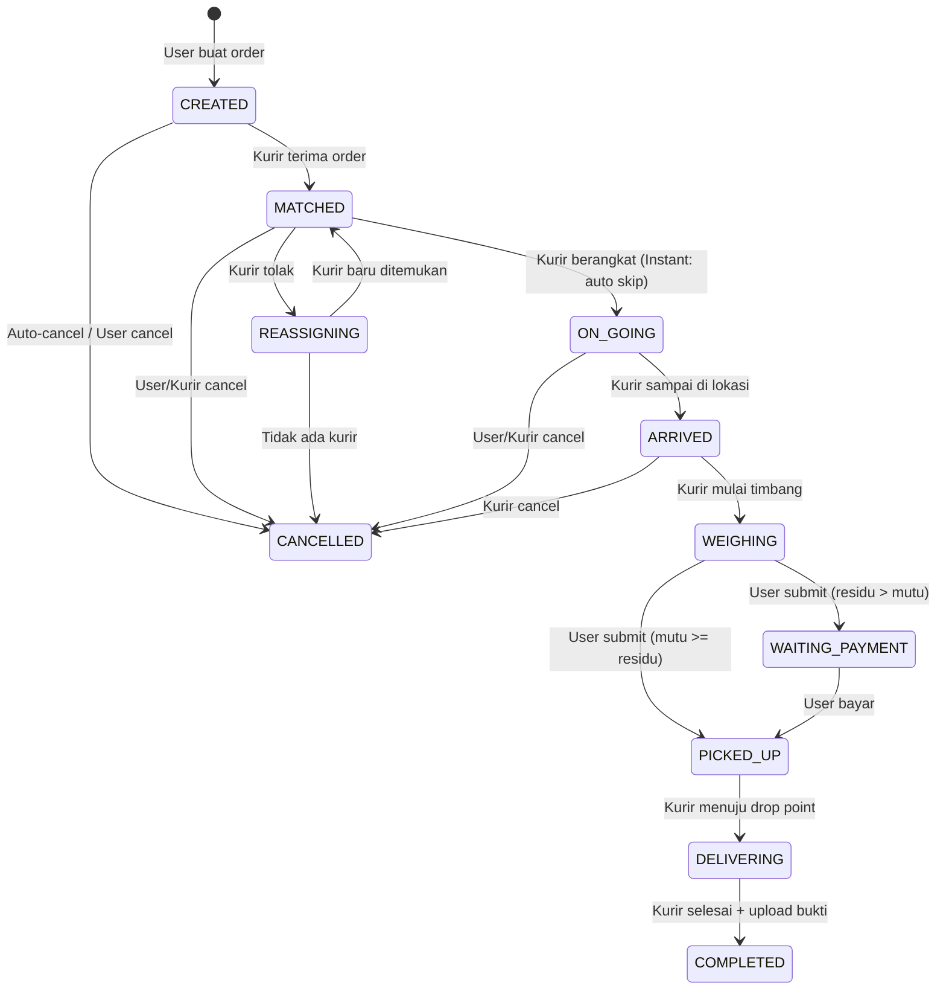

---

## 📱 Flow dari Sisi USER

### Phase 1: Membuat Order

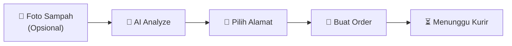

| Step | Endpoint | Method | Deskripsi |
|------|----------|--------|-----------|
| AI Analyze (opsional) | `/orders/ai-analyze` | `POST` | Analisa foto sampah untuk estimasi volume & rekomendasi kendaraan |
| Buat Order | `/orders` | `POST` | Buat order baru. Sistem otomatis broadcast ke kurir terdekat |

#### Request: `POST /orders`
```json
{
  "addressId": "uuid-alamat",
  "scheduleType": "INSTANT",       // atau "SCHEDULED"
  "scheduledAt": "2026-05-20T10:00:00Z",  // wajib jika SCHEDULED
  "note": "Di depan pagar hitam",
  "aiResultId": "uuid-ai-result"   // opsional, dari ai-analyze
}
```

#### Request: `POST /orders/ai-analyze` (opsional)
```json
{
  "imageUrl": "https://storage.angkutin.com/temp/foto-sampah.jpg",
  "manualHint": "Kardus bekas banyak sekali"
}
```

---

### Phase 2: Menunggu & Tracking Kurir

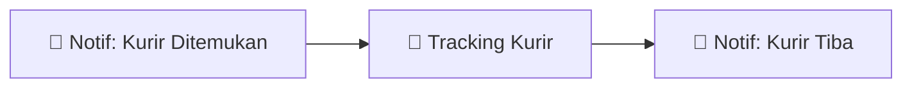

| Step | Endpoint | Method | Deskripsi |
|------|----------|--------|-----------|
| Lihat daftar order | `/orders` | `GET` | Filter by status via query `?status=ON_GOING` |
| Detail order | `/orders/:id` | `GET` | Detail lengkap order + info kurir |
| Track kurir | `/orders/:id/tracking` | `GET` | Lokasi terkini kurir (polling fallback) |
| History tracking | `/orders/:id/tracking/history` | `GET` | Semua titik GPS kurir |
| Timeline status | `/orders/:id/timeline` | `GET` | Riwayat perubahan status order |

> **📌 Tips Frontend:** Polling `GET /orders/:id/tracking` setiap 5-10 detik saat status `ON_GOING` untuk update posisi kurir di peta.

---

### Phase 3: Penimbangan & Konfirmasi

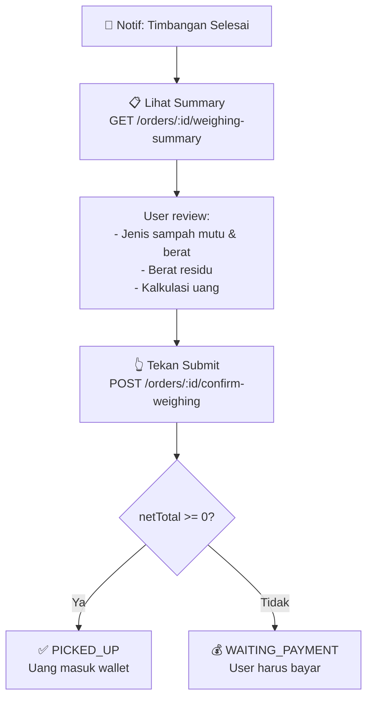

| Step | Endpoint | Method | Deskripsi |
|------|----------|--------|-----------|
| Lihat summary timbangan | `/orders/:id/weighing-summary` | `GET` | Breakdown mutu, residu, kalkulasi uang |
| Submit/konfirmasi timbangan | `/orders/:id/confirm-weighing` | `POST` | User trigger untuk lanjut ke step berikutnya |

#### Response: `GET /orders/:id/weighing-summary`
```json
{
  "orderId": "uuid",
  "status": "WEIGHING",
  "courier": {
    "id": "uuid",
    "name": "Budi Santoso",
    "phone": "081234567890",
    "vehicleType": "MOTOR"
  },
  "mutuItems": [
    {
      "id": "uuid",
      "wasteTypeName": "Kardus",
      "category": "MUTU",
      "weight": 5.2,
      "pricePerKg": 3000,
      "subtotal": 15600
    }
  ],
  "residuals": [
    {
      "id": "uuid",
      "weight": 2.5,
      "pricePerKg": 2000,
      "subtotal": 5000,
      "photoUrl": "https://storage.angkutin.com/residuals/xxx.jpg"
    }
  ],
  "summary": {
    "totalMutuWeight": 5.2,
    "totalResidualWeight": 2.5,
    "totalWeight": 7.7,
    "totalCredit": 15600,
    "totalDebit": 5000,
    "netTotal": 10600,
    "userReceives": 10600,
    "userPays": 0,
    "formattedCredit": "Rp 15.600",
    "formattedDebit": "Rp 5.000",
    "formattedNetTotal": "+ Rp 10.600",
    "formattedUserReceives": "Rp 10.600",
    "formattedUserPays": "Rp 0",
    "paymentRequired": false,
    "paymentStatus": null
  },
  "payment": null
}
```

> **📌 Tips Frontend:**
> - Jika `summary.paymentRequired === false` → Tampilkan tombol **"Submit"** saja
> - Jika `summary.paymentRequired === true` → Setelah submit, arahkan ke halaman pembayaran

---

### Phase 4: Pembayaran (Jika Residu > Mutu)

> Phase ini **hanya terjadi** jika `netTotal < 0` (user harus bayar biaya residu).

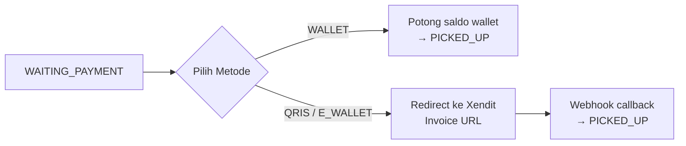

| Step | Endpoint | Method | Deskripsi |
|------|----------|--------|-----------|
| Bayar order | `/orders/:id/pay` | `POST` | Pilih metode: WALLET, QRIS, E_WALLET |
| Cek status bayar | `/orders/:id/payment` | `GET` | Status pembayaran (PENDING/PAID/EXPIRED) |

#### Request: `POST /orders/:id/pay`
```json
{
  "method": "WALLET"   // atau "QRIS" atau "E_WALLET"
}
```

#### Response (WALLET — langsung berhasil):
```json
{
  "id": "uuid-order",
  "status": "PICKED_UP",
  ...
}
```

#### Response (QRIS/E_WALLET — redirect ke Xendit):
```json
{
  "id": "uuid-payment",
  "amount": 5000,
  "method": "QRIS",
  "status": "PENDING",
  "invoiceUrl": "https://checkout.xendit.co/xyz",
  "expiredAt": "2026-05-16T21:00:00Z"
}
```

> **📌 Tips Frontend:**
> - Jika `method === WALLET`: Order langsung update, refresh halaman.
> - Jika `method === QRIS/E_WALLET`: Buka `invoiceUrl` di WebView/browser baru. Poll `GET /orders/:id/payment` sampai status `PAID`.

---

### Phase 5: Monitoring Sampai Selesai

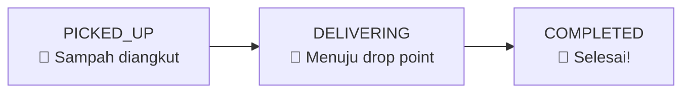

| Step | Endpoint | Method | Deskripsi |
|------|----------|--------|-----------|
| Lihat status terkini | `/orders/:id` | `GET` | Cek status order |
| Timeline | `/orders/:id/timeline` | `GET` | Seluruh riwayat status |

> User cukup **menunggu** push notification. Tidak ada aksi yang diperlukan.

---

### Pembatalan Order

| Step | Endpoint | Method | Deskripsi |
|------|----------|--------|-----------|
| Cancel order | `/orders/:id/cancel` | `POST` | User bisa cancel sebelum ARRIVED |

#### Request: `POST /orders/:id/cancel`
```json
{
  "reason": "Berubah pikiran"
}
```

#### Batasan Cancel (User):
| Status | Bisa Cancel? |
|--------|-------------|
| CREATED | ✅ |
| MATCHED | ✅ |
| ON_GOING | ✅ |
| ARRIVED | ❌ |
| WEIGHING | ❌ |
| PICKED_UP | ❌ |
| DELIVERING | ❌ |
| COMPLETED | ❌ |

> Jika sudah ada payment yang `PAID`, otomatis **refund** ke wallet user.

---

## 🏍️ Flow dari Sisi KURIR

### Phase 1: Menerima Order

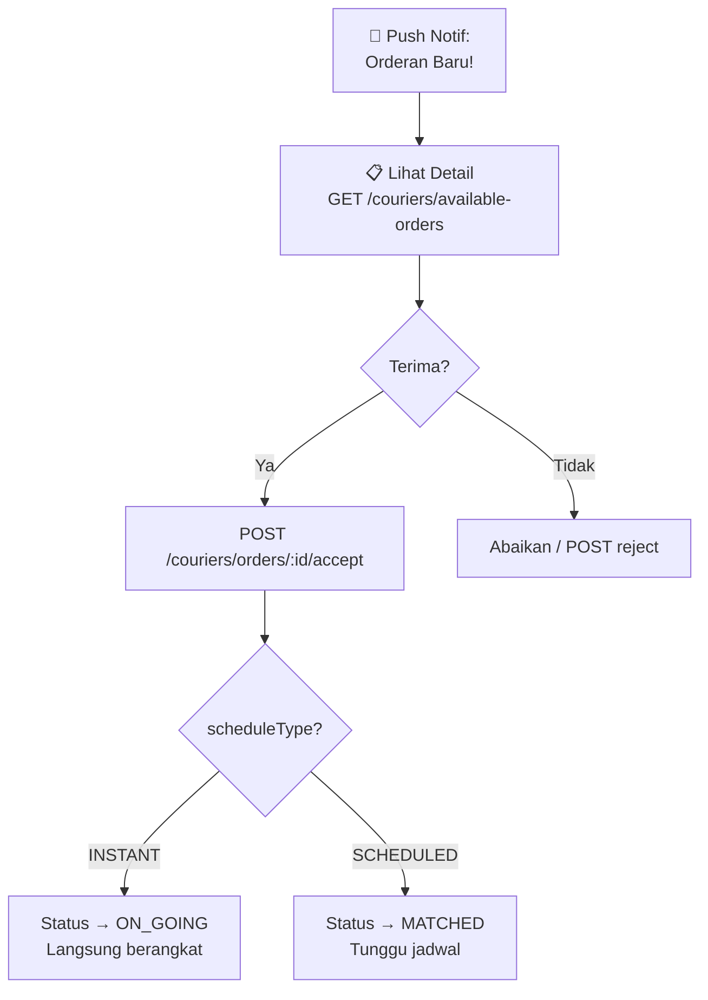

| Step | Endpoint | Method | Deskripsi |
|------|----------|--------|-----------|
| Lihat order tersedia | `/couriers/available-orders` | `GET` | Order yang belum ada kurir |
| Terima order | `/couriers/orders/:id/accept` | `POST` | Claim order (race condition safe) |
| Tolak order | `/couriers/orders/:id/reject` | `POST` | Tolak → re-broadcast ke kurir lain |
| Berangkat (scheduled) | `/couriers/orders/:id/depart` | `POST` | Khusus order SCHEDULED |

---

### Phase 2: Menuju Lokasi & Tiba

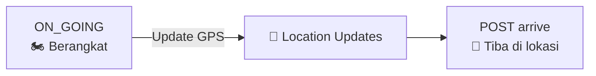

| Step | Endpoint | Method | Deskripsi |
|------|----------|--------|-----------|
| Update lokasi GPS | `/couriers/orders/:id/location` | `POST` | Kirim setiap 5-10 detik |
| Konfirmasi tiba | `/couriers/orders/:id/arrive` | `POST` | Status → ARRIVED |

#### Request: `POST /couriers/orders/:id/location`
```json
{
  "latitude": -7.2575,
  "longitude": 112.7521
}
```

---

### Phase 3: Penimbangan

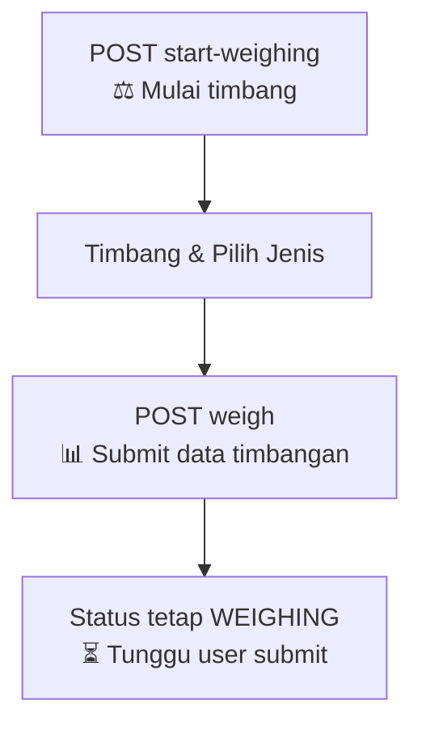

| Step | Endpoint | Method | Deskripsi |
|------|----------|--------|-----------|
| Mulai timbang | `/couriers/orders/:id/start-weighing` | `POST` | Status → WEIGHING |
| Submit data timbang | `/couriers/orders/:id/weigh` | `POST` | Upload data berat + foto (multipart) |

#### Request: `POST /couriers/orders/:id/weigh` (multipart/form-data)

| Field | Type | Wajib? | Deskripsi |
|-------|------|--------|-----------|
| `mutuItem` | string (JSON) | Tidak | Satu jenis sampah mutu. Format: `{"wasteTypeId": "uuid", "weight": 5.2}` |
| `residualWeight` | number | Tidak | Berat total sampah residu (kg) |
| `photo` | file (binary) | Tidak | Bukti foto sampah residu |

> **⚠️ Penting:** Kurir hanya bisa memilih **satu jenis** sampah mutu (bukan array). Setelah submit, status tetap `WEIGHING` sampai user mengkonfirmasi.

---

### Phase 4: Pengangkutan & Selesai

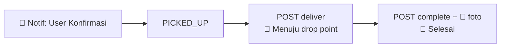

| Step | Endpoint | Method | Deskripsi |
|------|----------|--------|-----------|
| Pickup sampah | `/couriers/orders/:id/pickup` | `POST` | Status → PICKED_UP |
| Mulai kirim | `/couriers/orders/:id/deliver` | `POST` | Status → DELIVERING |
| Selesai + foto bukti | `/couriers/orders/:id/complete` | `POST` | Status → COMPLETED (wajib upload foto) |

#### Request: `POST /couriers/orders/:id/complete` (multipart/form-data)

| Field | Type | Wajib? | Deskripsi |
|-------|------|--------|-----------|
| `file` | file (binary) | ✅ Ya | Bukti foto pengiriman di drop point |

---

### Kurir: Endpoint Profil & Status

| Endpoint | Method | Deskripsi |
|----------|--------|-----------|
| `/couriers/profile` | `GET` | Profil kurir (nama, kendaraan, status online) |
| `/couriers/status` | `PATCH` | Toggle online/offline |
| `/couriers/location` | `PATCH` | Update GPS umum (bukan per-order) |
| `/couriers/orders` | `GET` | Daftar order kurir. Filter: `?status=ON_GOING` |
| `/couriers/orders/:id` | `GET` | Detail order spesifik |

---

## 🔔 Push Notifications

Semua notifikasi dikirim otomatis oleh backend. Frontend perlu **menampilkan** notifikasi dan **navigasi** ke halaman yang tepat.

### Notifikasi ke User

| Type | Kapan | Judul | Aksi Frontend |
|------|-------|-------|---------------|
| `NEW_ORDER` | — | — | *(tidak ke user)* |
| `ORDER_UPDATE` | Status berubah (MATCHED, ON_GOING, ARRIVED, COMPLETED) | Sesuai status | Navigate ke detail order |
| `WEIGHING_COMPLETE` | Kurir selesai timbang | ⚖️ Timbangan Selesai | Navigate ke **weighing-summary** page |
| `PAYMENT_REQUIRED` | — | *(deprecated, diganti WEIGHING_COMPLETE)* | — |
| `PAYMENT_SUCCESS` | Pembayaran berhasil via Xendit | 💰 Pembayaran Diterima | Refresh order detail |
| `ORDER_CANCELLED` | Order auto-cancel (tidak ada kurir) | ❌ Pesanan Dibatalkan | Navigate ke history |

### Notifikasi ke Kurir

| Type | Kapan | Judul | Aksi Frontend |
|------|-------|-------|---------------|
| `NEW_ORDER` | Ada order baru di sekitar | 🚛 Orderan Baru! | Navigate ke **available-orders** |
| `WEIGHING_CONFIRMED` | User konfirmasi timbangan | ✅ Timbangan Dikonfirmasi | Navigate ke order detail, lanjut pickup |
| `PAYMENT_SUCCESS` | User bayar (jika WAITING_PAYMENT) | 💰 Pembayaran Diterima | Navigate ke order detail, lanjut pickup |

---

## 🔐 Auth Header

Semua endpoint membutuhkan JWT token di header:

```
Authorization: Bearer <access_token>
```

---

## 📊 Status Enum Reference

```typescript
enum OrderStatus {
  CREATED          // Baru dibuat, menunggu kurir
  MATCHED          // Kurir ditemukan
  ON_GOING         // Kurir dalam perjalanan
  ARRIVED          // Kurir tiba di lokasi user
  WEIGHING         // Proses penimbangan (kurir submit → user confirm)
  WAITING_PAYMENT  // User harus bayar (residu > mutu)
  PICKED_UP        // Sampah sudah diangkut
  DELIVERING       // Menuju drop point daur ulang
  COMPLETED        // Order selesai
  CANCELLED        // Dibatalkan
  REASSIGNING      // Mencari kurir pengganti
}
```

---

## 💰 Kalkulasi Keuangan

```
┌──────────────────────────────────────────────────┐
│  Sampah MUTU (bernilai jual)                     │
│  Contoh: Kardus 5.2 kg × Rp 3.000 = Rp 15.600  │
│                                                  │
│  → totalCredit = Rp 15.600  (USER DAPAT UANG)   │
├──────────────────────────────────────────────────┤
│  Sampah RESIDU (biaya angkut)                    │
│  Contoh: 2.5 kg × Rp 2.000 = Rp 5.000           │
│                                                  │
│  → totalDebit = Rp 5.000   (USER BAYAR)          │
├──────────────────────────────────────────────────┤
│  netTotal = totalCredit - totalDebit             │
│  netTotal = Rp 15.600 - Rp 5.000 = Rp 10.600    │
│                                                  │
│  netTotal >= 0 → User terima Rp 10.600 ke wallet │
│  netTotal <  0 → User harus bayar Rp |netTotal|  │
└──────────────────────────────────────────────────┘
```

---

## 🗺️ Full Sequence Diagram

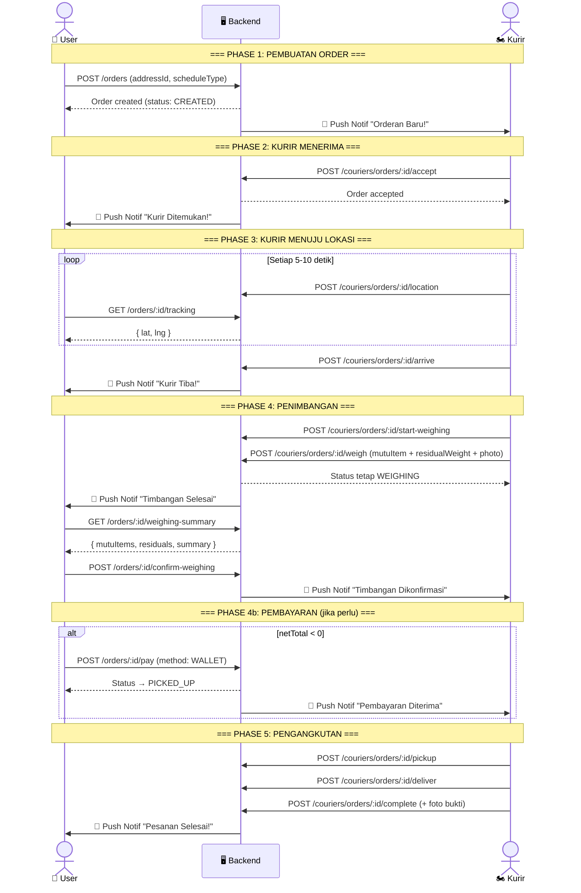
