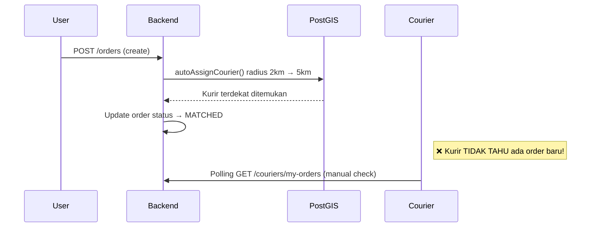
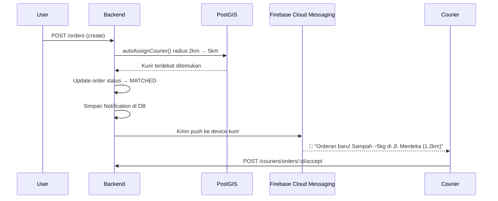
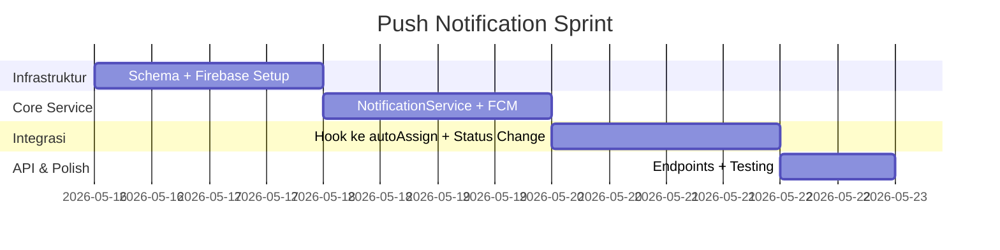

# 🔔 Angkutin — Push Notification Sprint Backlog

> Implementasi push notification untuk kurir saat ada orderan baru yang sesuai kriteria dan radius.

---

## Analisis Kondisi Saat Ini

| Komponen | Status |
|----------|--------|
| Model `Notification` di Schema | ✅ Sudah ada (title, body, type, isRead) |
| Model `Courier` (lat/lng, isOnline, vehicleType) | ✅ Sudah ada |
| FCM Token storage di DB | ❌ **Belum ada** — perlu tambah field |
| Firebase Admin SDK (`firebase-admin`) | ❌ **Belum terinstall** |
| `NotificationService` / `NotificationModule` | ❌ **Belum ada** |
| PostGIS radius search (`autoAssignCourier`) | ✅ Sudah ada di [orders.service.ts](file:///f:/Disk%20E/project%20coding/angkutin/angkutin-be/src/orders/orders.service.ts#L367-L445) |

### Alur Saat Ini (Tanpa Notifikasi)



### Alur Yang Diinginkan (Dengan Push Notification)



---

## Overview Sprint



---

## Task N.1 — Schema Migration: Tambah `fcmToken` di User

| Item | Detail |
|------|--------|
| **Story Point** | 1 |
| **File** | [schema.prisma](file:///f:/Disk%20E/project%20coding/angkutin/angkutin-be/prisma/schema.prisma#L88-L117) |
| **Deskripsi** | Tambahkan field `fcmToken` di model `User` untuk menyimpan Firebase Cloud Messaging device token dari aplikasi mobile. |

**Detail Perubahan:**
```prisma
model User {
  // ... existing fields
  fcmToken     String?    @map("fcm_token")   // ← BARU
}
```

> [!NOTE]
> Satu user = satu device aktif. Jika user login di device baru, token lama di-replace.
> Jika di masa depan perlu multi-device, buat tabel `UserDevice` terpisah.

**Acceptance Criteria:**
- [ ] Field `fcmToken` ada di model `User`
- [ ] Migration berhasil dijalankan (`npx prisma migrate dev`)
- [ ] `npx prisma generate` berhasil, tipe terupdate

---

## Task N.2 — Install & Setup Firebase Admin SDK

| Item | Detail |
|------|--------|
| **Story Point** | 2 |
| **Deskripsi** | Install `firebase-admin` dan konfigurasikan di backend NestJS. |

**Detail Implementasi:**
```bash
npm install firebase-admin
```

**Konfigurasi:**
1. Download **Service Account JSON** dari Firebase Console → Project Settings → Service Accounts
2. Simpan file JSON di root project sebagai `firebase-service-account.json`
3. Tambahkan ke `.env`:
   ```env
   FIREBASE_SERVICE_ACCOUNT_PATH=./firebase-service-account.json
   ```
4. Tambahkan ke `.gitignore`:
   ```
   firebase-service-account.json
   ```

**Acceptance Criteria:**
- [ ] `firebase-admin` terinstall di `package.json`
- [ ] Service account JSON tersedia dan ter-gitignore
- [ ] Firebase Admin SDK terinisialisasi tanpa error saat server start

---

## Task N.3 — Buat NotificationModule & NotificationService

| Item | Detail |
|------|--------|
| **Story Point** | 5 |
| **Files** | `src/notifications/notification.service.ts`, `src/notifications/notification.module.ts`, `src/notifications/notification.controller.ts` |
| **Deskripsi** | Buat service utama untuk mengirim push notification via FCM dan menyimpan riwayat di tabel `Notification`. |

**Struktur Service:**
```typescript
@Injectable()
export class NotificationService {
  // 1. Kirim push + simpan ke DB
  async sendPushNotification(params: {
    userId: string;
    title: string;
    body: string;
    type?: string;       // 'NEW_ORDER' | 'ORDER_UPDATE' | 'PAYMENT' | dll
    data?: Record<string, string>; // Extra data untuk deeplink di app
  }): Promise<void>

  // 2. Kirim ke multiple users sekaligus
  async sendToMultipleUsers(params: {
    userIds: string[];
    title: string;
    body: string;
    type?: string;
    data?: Record<string, string>;
  }): Promise<void>

  // 3. Update FCM token (dipanggil saat login/refresh)
  async updateFcmToken(userId: string, fcmToken: string): Promise<void>

  // 4. Ambil notifikasi user (untuk in-app notification list)
  async getUserNotifications(userId: string, page?: number): Promise<Notification[]>

  // 5. Tandai notifikasi sudah dibaca
  async markAsRead(notificationId: string, userId: string): Promise<void>

  // 6. Tandai semua sudah dibaca
  async markAllAsRead(userId: string): Promise<void>
}
```

**Acceptance Criteria:**
- [ ] `NotificationService` bisa mengirim push via FCM
- [ ] Notifikasi tersimpan di tabel `Notification` (riwayat in-app)
- [ ] Jika user tidak punya `fcmToken`, notifikasi tetap tersimpan di DB (tapi push tidak dikirim)
- [ ] Error FCM di-handle gracefully (log error, jangan crash)
- [ ] Module terdaftar di `AppModule`

---

## Task N.4 — Endpoint: Update FCM Token

| Item | Detail |
|------|--------|
| **Story Point** | 1 |
| **File** | `src/notifications/notification.controller.ts` atau `src/auth/auth.controller.ts` |
| **Deskripsi** | Endpoint untuk app mobile mengirimkan FCM token setelah login. |

**Endpoint:**
```
PATCH /api/notifications/fcm-token
Body: { "fcmToken": "dKw8sn2x..." }
```

**Kapan dipanggil oleh App:**
1. Setelah login berhasil
2. Saat token di-refresh oleh Firebase SDK di client
3. Saat app kembali dari background (opsional)

**Acceptance Criteria:**
- [ ] Endpoint menerima dan menyimpan FCM token
- [ ] Token lama di-replace (bukan append)
- [ ] Swagger docs lengkap

---

## Task N.5 — Integrasi: Push Notif saat Order Matched (autoAssignCourier)

| Item | Detail |
|------|--------|
| **Story Point** | 3 |
| **File** | [orders.service.ts](file:///f:/Disk%20E/project%20coding/angkutin/angkutin-be/src/orders/orders.service.ts#L367-L445) |
| **Deskripsi** | Setelah `autoAssignCourier` berhasil menemukan kurir, kirim push notification ke kurir tersebut. |

**Titik Integrasi di `autoAssignCourier`:**
```typescript
// Di dalam blok: if (couriers.length > 0)
// SETELAH: tx.orderStatusHistory.create(...)

await this.notificationService.sendPushNotification({
  userId: courier.user_id,
  title: '🚛 Orderan Baru!',
  body: `Pickup sampah ~${order.aiResults[0]?.volumeEstimation?.toFixed(1) || '?'}L di ${order.address.district} (${(courier.distance / 1000).toFixed(1)}km)`,
  type: 'NEW_ORDER',
  data: {
    orderId: orderId,
    action: 'OPEN_ORDER_DETAIL',
  },
});
```

**Konten Notifikasi:**

| Field | Contoh |
|-------|--------|
| **Title** | 🚛 Orderan Baru! |
| **Body** | Pickup sampah ~5.2L di Kec. Lowokwaru (1.3km) |
| **type** | `NEW_ORDER` |
| **data.orderId** | `uuid-order-id` |
| **data.action** | `OPEN_ORDER_DETAIL` |

> [!IMPORTANT]
> **Hanya kurir yang ter-assign (radius pertama yang match) yang menerima notifikasi.**
> Ini sesuai dengan permintaan: notif hanya dikirim ke kurir yang masuk kriteria & radius pertama yang cocok.

**Acceptance Criteria:**
- [ ] Kurir yang di-assign menerima push notification
- [ ] Notifikasi berisi info lokasi dan estimasi jarak
- [ ] Record `Notification` tersimpan di DB
- [ ] Jika kurir tidak punya FCM token, notif tetap tersimpan di DB

---

## Task N.6 — Endpoint: Get & Read Notifications (In-App)

| Item | Detail |
|------|--------|
| **Story Point** | 2 |
| **File** | `src/notifications/notification.controller.ts` |
| **Deskripsi** | Endpoint untuk menampilkan daftar notifikasi di dalam aplikasi dan menandai sudah dibaca. |

**Endpoints:**
```
GET    /api/notifications          → Daftar notifikasi user (paginated)
PATCH  /api/notifications/:id/read → Tandai satu notifikasi sudah dibaca
PATCH  /api/notifications/read-all → Tandai semua sudah dibaca
GET    /api/notifications/unread-count → Jumlah notifikasi belum dibaca
```

**Acceptance Criteria:**
- [ ] List notifikasi ter-paginated (default 20 per page)
- [ ] Urutan: terbaru dulu (`createdAt DESC`)
- [ ] Mark as read mengubah `isRead: true`
- [ ] Unread count untuk badge di app
- [ ] Swagger docs lengkap

---

## Task N.7 — (Opsional) Notifikasi untuk Event Lain

| Item | Detail |
|------|--------|
| **Story Point** | 3 |
| **Deskripsi** | Tambahkan push notification untuk event-event penting lainnya. |

**Event yang bisa ditambahkan:**

| Event | Penerima | Title | Body |
|-------|----------|-------|------|
| Kurir Accept | User | ✅ Kurir Ditemukan | Kurir {name} akan menjemput sampah Anda |
| Kurir Depart | User | 🚛 Kurir Berangkat | Kurir sedang menuju lokasi Anda |
| Kurir Arrived | User | 📍 Kurir Tiba | Kurir sudah sampai, siapkan sampah Anda |
| Triage Selesai (net < 0) | User | 💰 Pembayaran Diperlukan | Silakan bayar Rp {amount} untuk biaya residu |
| Payment Success | Kurir | ✅ Pembayaran Diterima | User telah membayar, lanjutkan pengangkutan |
| Order Completed | User | 🎉 Pesanan Selesai | Saldo Anda bertambah Rp {amount} |
| Order Cancelled | Kurir/User | ❌ Pesanan Dibatalkan | Pesanan #{id} telah dibatalkan |

**Acceptance Criteria:**
- [ ] Minimal 3 event tambahan terimplementasi
- [ ] Setiap event menggunakan `type` yang berbeda untuk filtering di app
- [ ] Data deeplink (`data.orderId`, `data.action`) tersedia

---

## Ringkasan

| Task | Deskripsi | SP | Prioritas |
|------|-----------|:--:|:---------:|
| **N.1** | Schema: Tambah `fcmToken` | 1 | 🔴 Wajib |
| **N.2** | Install & Setup Firebase Admin | 2 | 🔴 Wajib |
| **N.3** | NotificationService + Module | 5 | 🔴 Wajib |
| **N.4** | Endpoint: Update FCM Token | 1 | 🔴 Wajib |
| **N.5** | Hook: Push saat Order Matched | 3 | 🔴 Wajib |
| **N.6** | Endpoint: List & Read Notif | 2 | 🟡 Penting |
| **N.7** | Notif untuk Event Lain | 3 | 🟢 Opsional |
| **Total** | | **17 SP** | **~7 hari** |

---

## File Baru yang Perlu Dibuat

| File | Task | Deskripsi |
|------|:----:|----|
| `src/notifications/notification.service.ts` | N.3 | Service utama FCM + DB |
| `src/notifications/notification.module.ts` | N.3 | Module registrasi |
| `src/notifications/notification.controller.ts` | N.4, N.6 | API endpoints |
| `firebase-service-account.json` | N.2 | Kredensial Firebase (gitignored) |

## File yang Perlu Dimodifikasi

| File | Task | Perubahan |
|------|:----:|-----------|
| `prisma/schema.prisma` | N.1 | Tambah `fcmToken` di User |
| `src/orders/orders.service.ts` | N.5 | Hook notif di `autoAssignCourier` |
| `src/app.module.ts` | N.3 | Register `NotificationModule` |
| `package.json` | N.2 | Install `firebase-admin` |
| `.gitignore` | N.2 | Ignore service account JSON |
| `.env` | N.2 | Tambah `FIREBASE_SERVICE_ACCOUNT_PATH` |

> [!TIP]
> **Urutan pengerjaan yang disarankan:** N.1 → N.2 → N.3 → N.4 → N.5 → N.6 → N.7
> Task N.1 dan N.2 adalah prasyarat untuk semua task lainnya.
